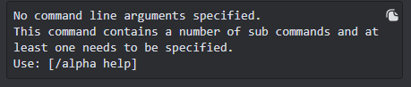

## ISAC V1 Documentation

This bot is responsable for tracking players in the game Tom Clancy's The Division or Division1. 

It responds to this command:
 - /alpha 

The system has a bunch of other commands that are derived from alpha. If you do not know the commands, you can simply run 
```/alpha```. Upon doing this you will be shown this message:



This is the bot telling you that you need to specify a sub command of alpha. Do what it says and run: ```/alpha help```. You should see this:


In other words, when you are lost and don't know what command to use, run ```/alpha help```, and the bot will showcase it's helper. Very easy.