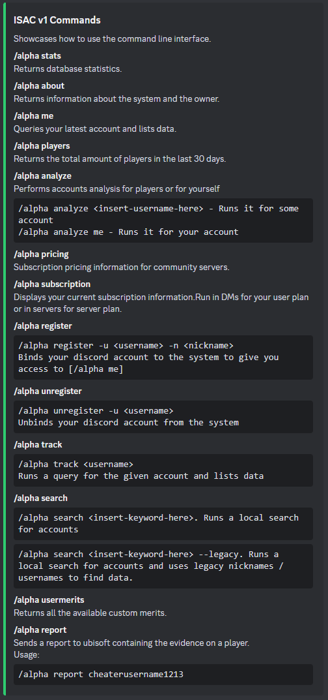

## ISAC V1 Documentation

This bot is responsable for tracking players in the game Tom Clancy's The Division or Division1. 

It responds to this command:
 - /alpha 

The system has a bunch of other commands that are derived from alpha. If you do not know the commands, you can simply run 
```/alpha```. Upon doing this you will be shown this message:


### 1. The helper
This is the bot telling you that you need to specify a sub command of alpha. Do what it says and run: ```/alpha help```. 
You should see this:



In other words, when you are lost and don't know what command to use, run ```/alpha help```, and the bot will showcase it's helper. Very easy.

### 2. Stats
```/alpha stats``` will showcase various database stats that are relevant to the current bot variant and it's global database. It will show this:


### 3. About
```/alpha about``` will return information about who built the system and what technologies it's using.


