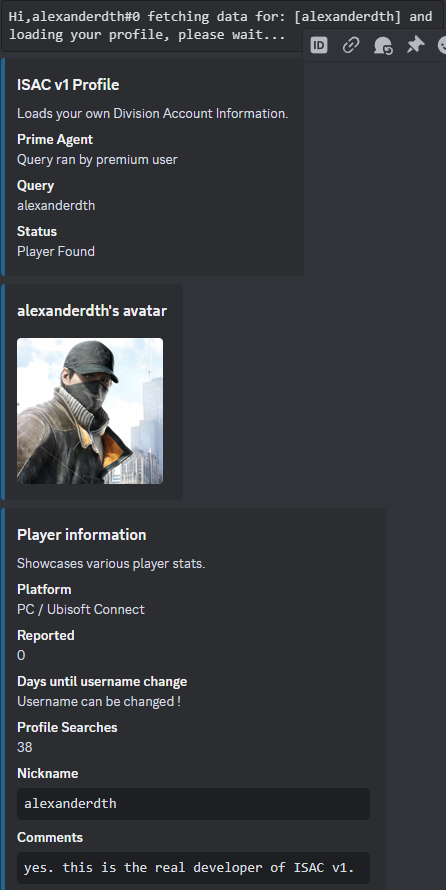
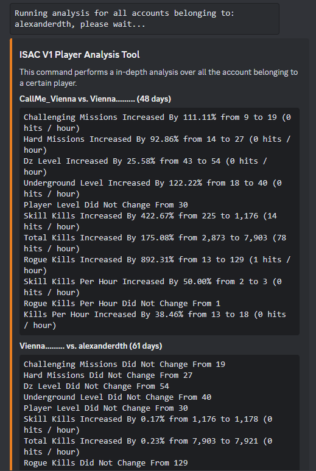
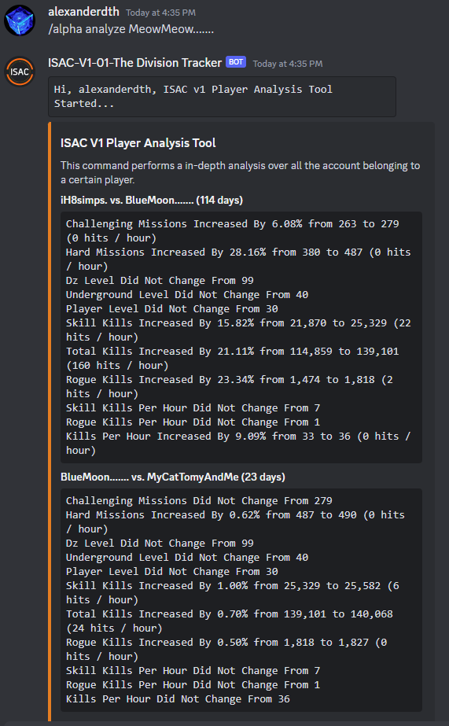

## ISAC V1 Documentation

This bot is responsable for tracking players in the game Tom Clancy's The Division or Division1. 

It responds to this command:
 - /alpha 

The system has a bunch of other commands that are derived from alpha. If you do not know the commands, you can simply run 
```/alpha```. Upon doing this you will be shown this message:


### 1. The helper
This is the bot telling you that you need to specify a sub command of alpha. Do what it says and run: ```/alpha help```. 
You should see this:


In other words, when you are lost and don't know what command to use, run ```/alpha help```, and the bot will showcase it's helper. Very easy.

### 2. Stats
```/alpha stats``` will showcase various database stats that are relevant to the current bot variant and it's global database. It will show this:


### 3. About
```/alpha about``` will return information about who built the system and what technologies it's using.


### 4. Me
```/alpha me``` is a command which will attempt to use your profile to track yourself. In other words, you track yourself. In order for this to work, you have to register your profile. For that, you may check the registration step below.



### 5. Analyze
```/alpha analyze``` is a command which attempts to use local data in order to perform static analysis between username changes. In pther words, every time someone changes name, their account information is logged and it's bound together by something called ```uplay id```. This ID is unique and cannot be change. It's what allows the system to store username changes and bind data. Leaving this explanation asside, we can use the account snapshots to calculate differences in between them. The command can be used in 2 pars:
 - ```/alpha analyze <insert-player-here>```, this will run it on a given player.
 - ```/alpha analyze me```, this will analyze it for youself, assuming you have an ISAC Profile registered.

 When running it, you should see something like this:
 - ```/alpha analyze me```:

 
 - ```/alpha analyze <insert-player-username>```:
  
 