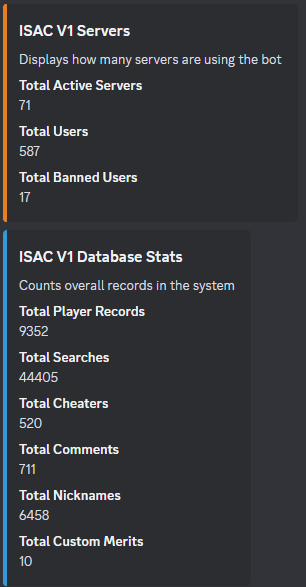
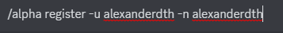
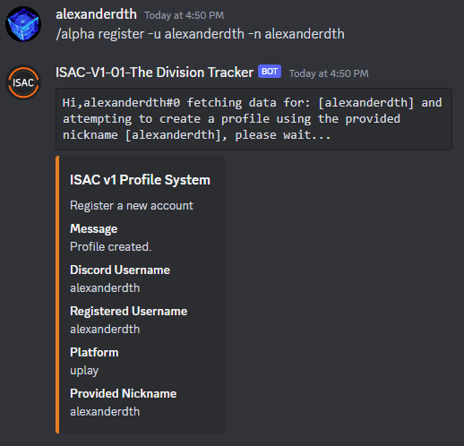
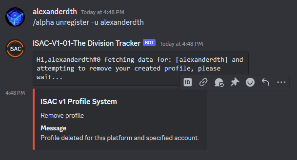

## ISAC V1 Documentation

This bot is responsable for tracking players in the game Tom Clancy's The Division or Division1. 

It responds to this command:
 - /alpha 

The system has a bunch of other commands that are derived from alpha. If you do not know the commands, you can simply run 
```/alpha```. Upon doing this you will be shown this message:


### 1. The helper
This is the bot telling you that you need to specify a sub command of alpha. Do what it says and run: ```/alpha help```. 
You should see this:


In other words, when you are lost and don't know what command to use, run ```/alpha help```, and the bot will showcase it's helper. Very easy.

### 2. Stats
```/alpha stats``` will showcase various database stats that are relevant to the current bot variant and it's global database. It will show this:



### 3. About
```/alpha about``` will return information about who built the system and what technologies it's using.


### 4. Me
```/alpha me``` is a command which will attempt to use your profile to track yourself. In other words, you track yourself. In order for this to work, you have to register your profile. For that, you may check the registration step below.


### 5. Analyze
```/alpha analyze``` is a command which attempts to use local data in order to perform static analysis between username changes. In pther words, every time someone changes name, their account information is logged and it's bound together by something called ```uplay id```. This ID is unique and cannot be change. It's what allows the system to store username changes and bind data. Leaving this explanation asside, we can use the account snapshots to calculate differences in between them. The command can be used in 2 pars:
 - ```/alpha analyze <insert-player-here>```, this will run it on a given player.
 - ```/alpha analyze me```, this will analyze it for youself, assuming you have an ISAC Profile registered.

 When running it, you should see something like this:
 - ```/alpha analyze me```:

 
 - ```/alpha analyze <insert-player-username>```:

 

 There is a possibility that you might encounter this error: ```Error performing analysis: Not enough data to analyze. There needs to be at least 2 entries in order to perform this.```. Do not panic, it's normal. If the user you are trying to analyze never changed name, the system cannot perform this, due to the fact that it requires at least 2 data points to execute the calculations.

 ### 4. Players
 ```/alpha players``` will return a rough estimate of how many players are active in game based on this month's searches. Yes, it's not accurate, but, at least it is something.


### 5. Pricing
```/alpha pricing``` will return subscription pricing information. In other words, ISAC is free to use in it's official discord server. But if you want to use it in your own server, which you don't have to, but if you want, you will have to get a sub. Of course, everyone get's a 30 day free trial.


### 6. Subscription
```/alpha subscription``` will return subscription information for your current active plan. You can run it in 2 ways:
 - DM, yes, ISAC can be DMed. This will return info on your user plan:

 
 - Server, which will return server subscription:

 

 ### 7. Registration
```/alpha register``` command, will help you bind your current discord account to your in-game Division account. This gives you access to:
 - ```/alpha analyze me``` - self-analysis
 - ```/alpha me``` - profile tracking

 Your first move would be to check  how you can use it. Which is very simple. ```/alpha register help```. This will display it's helper:

 

 To explain this better, it simply wants you to provide it with:
 - ```-u```, which is your in-game username
 - ```-n```, a nickname that you want people to call you by, as it will be displayed on your profile.
 - How to put them together: ```/alpha register -u <insert-username-here> -n <insert-nickname-here>```
 - Example:

 

 Upon running that, you will see this:

 

 ### Removing your profile
 ```/alpha unregister``` provides this functionality. Will not dive deep into this since it's the opposite to the step you find above. It will wipe your profile. 
 - Example:

