## ISAC 2.0 Documentation

This bot is responsible for tracking players in the game Tom Clancy's The Division2 or Division2.

It responds to the command:
 - ```/dth```

Initially you might find yourself lose, no worries, just give it a try, run: ```/dth```

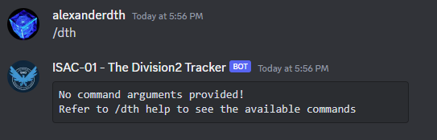

This is the bot replying to you and telling you that you use run: ```/dth help```, as it requires a sub commmand from the "dth" stack.

### 1. The Helper
```/dth help``` command, provides you with everything you need to know to get yourself started. It will showcase every command available to you. 


### 2. About
```/dth about``` command provides you with information on who buiilt the system and what tech stack the system uses. 


### 3. FAQ (Frequently Asked Questions)
```/dth faq``` command provides a convenient way to list information about ISAC, what people are curious about, the rules and more. Its contents are frequently updated so the image below, might not reflect it's current state. 


### 4. Active Players
```/dth active-players``` is a command which outputs a rough estimate of active players, based on local data. It's not accurate, we know, but, it's the closest thing you got for Division2, in terms of online players. 


### 5. Username Check
```/dth username-check <insert-platform> <insert-username>``` provides you with an easy way to see if the username you want to change to is available or not. As a general idea, the platform can take 3 values:
 - pc: 

 

 - psn (Playstation Network)


 - xbox

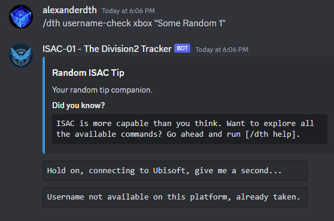

### 6. Subscription
```/dth subscription``` will display subscription information related to ISAC. As a general idea, ISAC is free to use in it's official discord. But, in order to use it in a private server, you will have to have an active trial or subscription.

This command can be ran in 2 places:
 - DMs (ISAC is indeed DMable) -> displays your user subscription info

 

 - Server -> Displays Server Subscription info

 

### 7. Daily Loot
```/dth daily-loot``` command, will showcase today's targeted loot.


### 7. Analyze
```/alpha analyze``` is a command which attempts to use local data in order to perform static analysis between username changes. In pther words, every time someone changes name, their account information is logged and it's bound together by something called ```uplay id```. This ID is unique and cannot be change. It's what allows the system to store username changes and bind data. Leaving this explanation asside, we can use the account snapshots to calculate differences in between them. The command can be used in 2 pars:
 - ```/alpha analyze <insert-player-here>```, this will run it on a given player.
 - ```/alpha analyze me```, this will analyze it for youself, assuming you have an ISAC Profile registered.

 Examples:
  - Self Analysis:

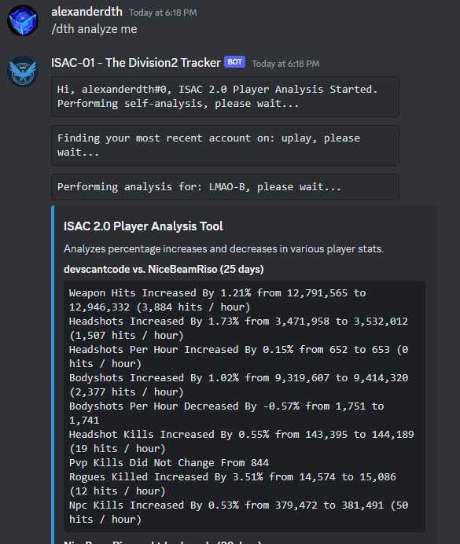

  - Player Analysis:

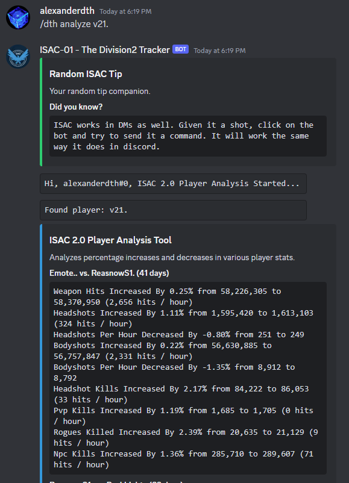

### 8. Compare
```/dth compare <insert-first-username> <insert-second-username>``` will atempt to compare 2 accounts, calculate a score and simply determine which score is higher. The score consists of headshots, bodyshots and crits. Of course, headshots have a 0.2 modified, since they require more skill. Example:

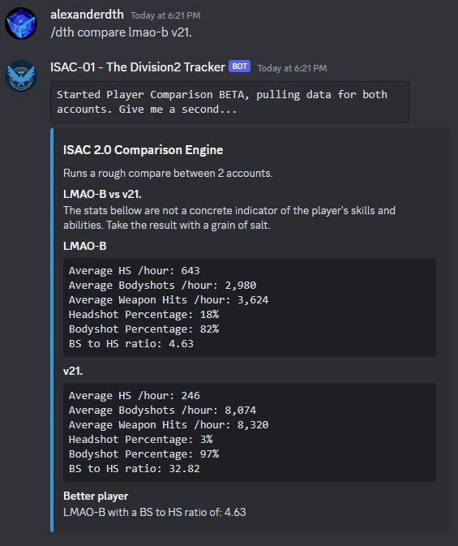

### 9. Generate Password
```/dth generate-password``` is a handy command which generates Ubisoft Compliant secure passwords. (WE DO NOT STORE ANYTHING, the bot doesn't know if you chose a password or not). The command accepts one single argument which is optional, that is, password length. By default, Ubisoft requires a password which contains a maximum of 16 characters. You can generate a password with a length with up to 30. ```/dth generate-password 30```. Example:


As you can see it generates an extremely secure password that is almost impossible to crack and is Ubisoft Compliant. 

### 10. Generate Username
```/dth generate-username``` will attempt to randomly generate a list of 16 usernames, by default. You may generate a maximum of 30 per execution by doing ```/dth generate-username 30```. Example:


### 11. User Merits
```/dth user-merits``` is a command that showcases ISAC's merit system. The system has 2 types of merits:
 - Automatic  / Auto-Assigned based on player stats
 - Manual / Custom (Assigned by Staff Members)

In terms of custom merits, you will see "Cheater Companion or Cybersherlock", the most predominant ones. 

It's important to explain that ISAC's merit system is found on every ISAC profile, right under ```Listed Merits```

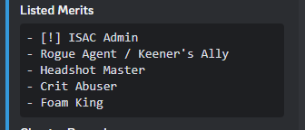

Running ```/dth user-merits``` will output:

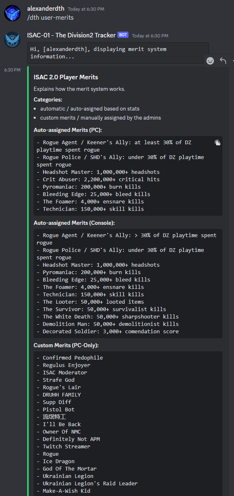

### 12. Registration

```/dth register -u <insert-username> -p <insert-platform> -n <insert-nickname>```, will enable you to create an ISAC profile, which is bound to your Discord Account. This will enable you to track yourself and perform self-analysis. Here's how you can use it:
 - Run ```/dth register help``` first, to see the helper:

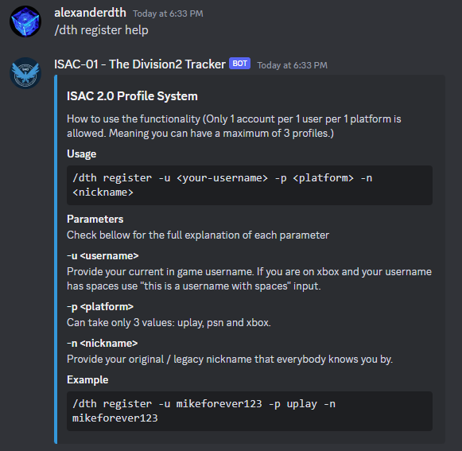
 
 - Based on the helper, you can see it requires some things, in order to work. Let's break it down together:
 - ```-u <insert-username>```, requests your in-game username
 - ```-p <insert-platform>```, requests your platform. This can take one of the following values: ```uplay``` for pc, ```psn``` for PlayStation and ```xbox``` for XBOX Live.   
 - ```-n <insert-nickname>```, requests your nickname. You can set any nickname you want. 

 What's important as well is that, you can create 3 profiles. One for every platform.

 Now, let's try an example and see how it works:

 ```/dth register -u lmao-b -p uplay -n alexanderdth```

 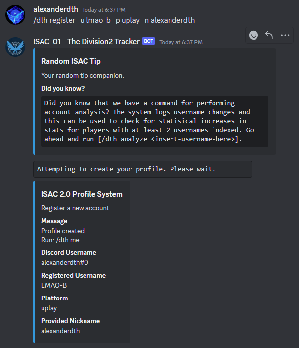

 ### 13. Removing your profile / Unregistering
 ```/dth unregister -u <insert-username> -p <insert-platform>``` will allow you to wipe your data. Simple and effective. It's the opposite of the command found above. Follow the same logic. 

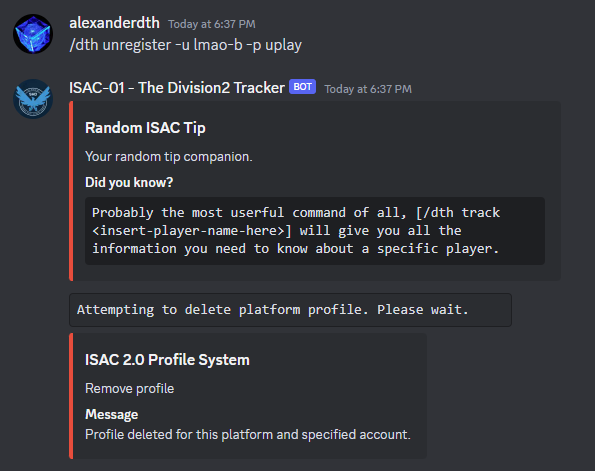

### 14. Me

```/dth me``` is a command which pulls your account information based on a profile you created using the above steps. So, you have to have a profile registered for this to work. 


### 15. Track
```/dth track <insert-username-here>``` is without a doubt the most popular command. It pulls data straight from Ubisoft's servers, passes it through our algorithms, saves it and then finally, serves it to you.


 ### 16. Search
 ```/dth search <insert-keyword>``` is basically ISAC's own version of Google. Since ISAC stores it's data in a database, it makes it possible for users to search for it. This is useful in case you do not remember a name, you're lazy or you simply want to explore what you can find. It requires a simple keyword. Contrary to ```/dth track <insert-username-here>```, it does not require the EXACT username, instead, you provide it with a keyword. Example:

 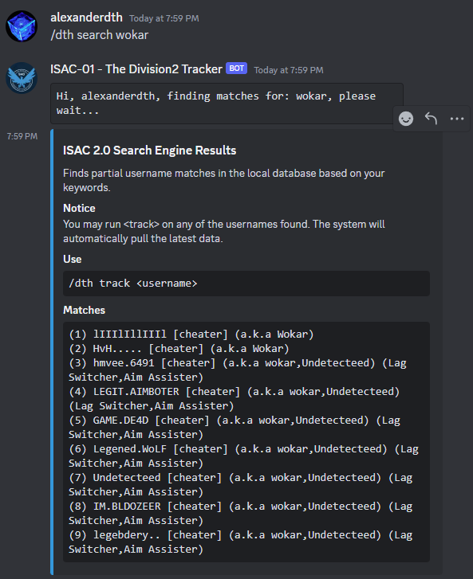

There is an additional parameter which you can send it, ```--legacy```. ISAC has a built-in method from grabbing older usernames. Some proviles have something listed on them that reads ```Legacy / Pre-ISAC Usernames```. This is essentially a list of really old names auto-grabbed. You can "force" ISAC to search the database, based on these names.
 - Example:

 

### 17. Playstation / XBOX Tracking
We do support consoles to some extend, hence we have 2 endpoints to use for consoles. They are:
 - ```/dth psn track <insert-username-here>```
 - ```/dth xbox track <insert-username-here>```

 Keep in mind, since xbox contains usernames with spaces, you will have to encapsulate your username in between "". In other words:
  - ```/dth xbox track "i am player 123"```

### 18. History
```/dth history``` is a command which allows you to keep track of who you searched for. It's a feature that is not widely used, but know this, it's there. You may also specify the optional paramter ```console```, in order to pull information. 

Examples:
 - In DM (Listing global searches):


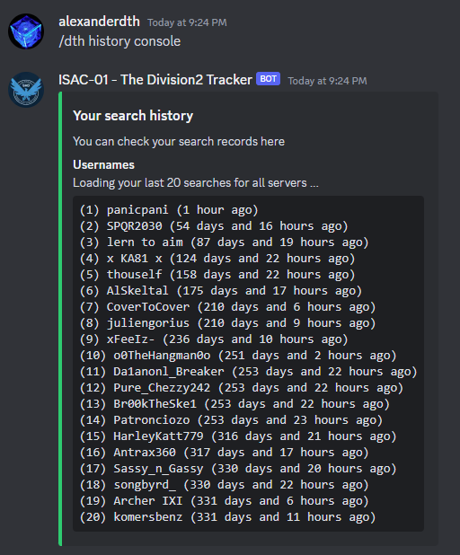

- In a server (Lists searches from THAT server):

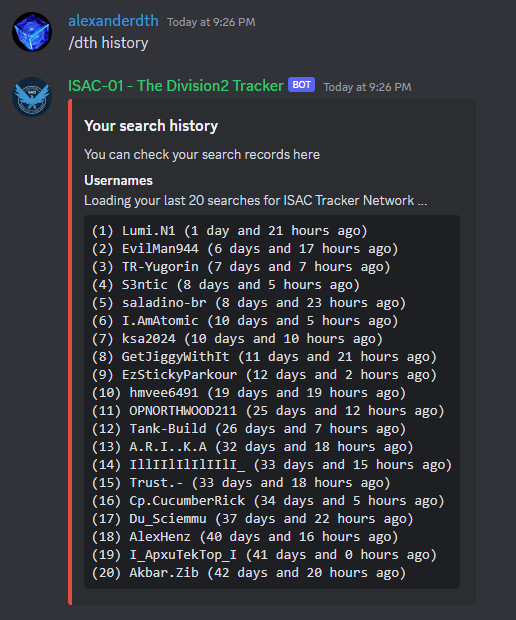


### 19. Watchlist
```/dth watchlist``` is another obscure, but very powerful command. It's purpose is simple: store players on your personal watchlist. It's like your personal storage space. If you got people you want to keep an eye on, drop them in the watchlist. 


You got a limit of 40 usernames you can store on your watchlist. It's usage is very simple:
 - ```-a <insert-username>```, adds a player
 - ```-rm <insert-username>```, removes a player
 - ```-all```, lists your players

 Now, let's give it a try, let's add a player:

 

 Let's list our items:

 

 Finally, let's wipe a record:

 

 As you can see, the functionality is very easy to use. The information displayed includes
 - current username
 - username history
 - player merits alongside cheater status.

 ### 20. Report
```/dth report``` is the command you want to use, if you want to send us evidence. It requires a few parameters, but we'll walk you through it. Go ahead and run ```/dth report help```.

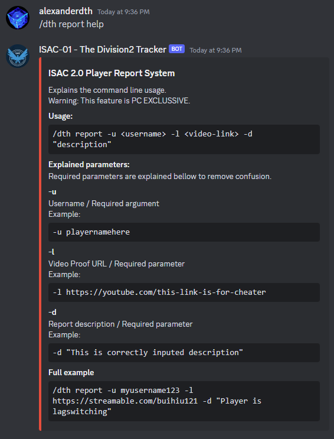