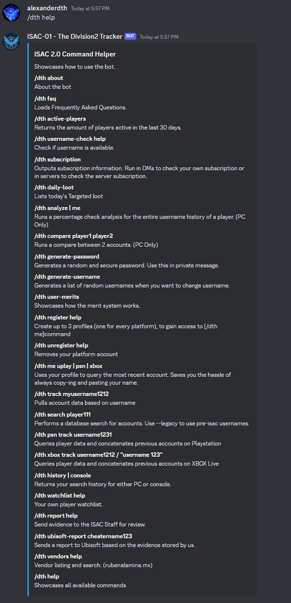
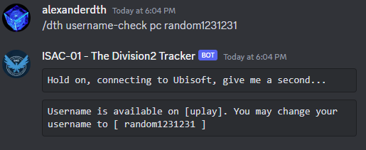
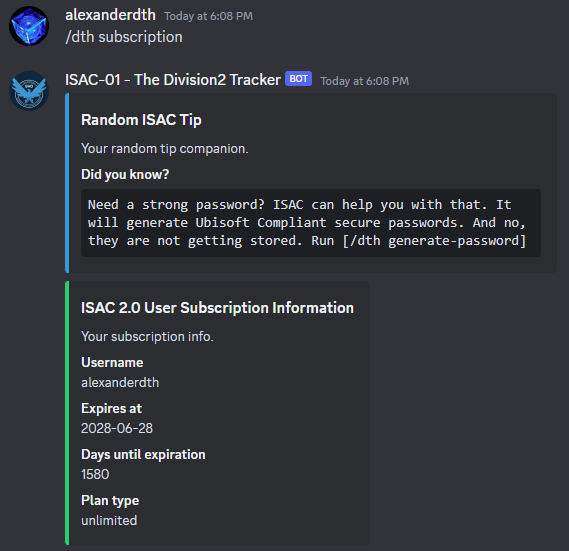

## ISAC 2.0 Documentation

This bot is responsible for tracking players in the game Tom Clancy's The Division2 or Division2.

It responds to the command:
 - ```/dth```

Initially you might find yourself lose, no worries, just give it a try, run: ```/dth```


This is the bot replying to you and telling you that you use run: ```/dth help```, as it requires a sub commmand from the "dth" stack.

### 1. The Helper
```/dth help``` command, provides you with everything you need to know to get yourself started. It will showcase every command available to you. 



### 2. About
```/dth about``` command provides you with information on who buiilt the system and what tech stack the system uses. 


### 3. FAQ (Frequently Asked Questions)
```/dth faq``` command provides a convenient way to list information about ISAC, what people are curious about, the rules and more. Its contents are frequently updated so the image below, might not reflect it's current state. 


### 4. Active Players
```/dth active-players``` is a command which outputs a rough estimate of active players, based on local data. It's not accurate, we know, but, it's the closest thing you got for Division2, in terms of online players. 


### 5. Username Check
```/dth username-check <insert-platform> <insert-username>``` provides you with an easy way to see if the username you want to change to is available or not. As a general idea, the platform can take 3 values:
 - pc: 

 

 - psn (Playstation Network)


 - xbox


### 6. Subscription
```/dth subscription``` will display subscription information related to ISAC. As a general idea, ISAC is free to use in it's official discord. But, in order to use it in a private server, you will have to have an active trial or subscription.

This command can be ran in 2 places:
 - DMs (ISAC is indeed DMable) -> displays your user subscription info

 

 - Server -> Displays Server Subscription info
 
 