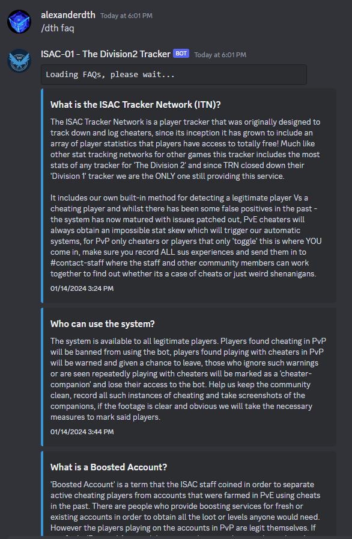
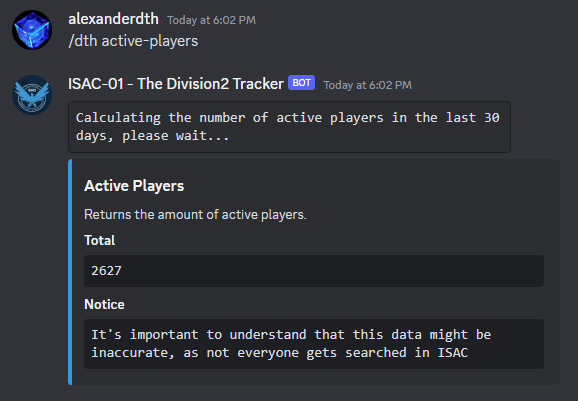
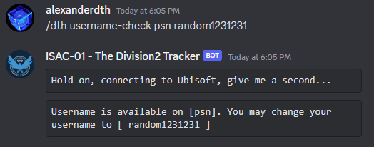
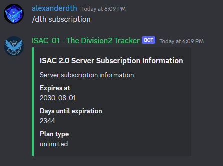
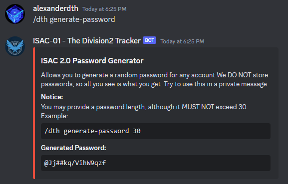

## ISAC 2.0 Documentation

This bot is responsible for tracking players in the game Tom Clancy's The Division2 or Division2.

It responds to the command:
 - ```/dth```

Initially you might find yourself lose, no worries, just give it a try, run: ```/dth```


This is the bot replying to you and telling you that you use run: ```/dth help```, as it requires a sub commmand from the "dth" stack.

### 1. The Helper
```/dth help``` command, provides you with everything you need to know to get yourself started. It will showcase every command available to you. 


### 2. About
```/dth about``` command provides you with information on who buiilt the system and what tech stack the system uses. 


### 3. FAQ (Frequently Asked Questions)
```/dth faq``` command provides a convenient way to list information about ISAC, what people are curious about, the rules and more. Its contents are frequently updated so the image below, might not reflect it's current state. 



### 4. Active Players
```/dth active-players``` is a command which outputs a rough estimate of active players, based on local data. It's not accurate, we know, but, it's the closest thing you got for Division2, in terms of online players. 



### 5. Username Check
```/dth username-check <insert-platform> <insert-username>``` provides you with an easy way to see if the username you want to change to is available or not. As a general idea, the platform can take 3 values:
 - pc: 

 

 - psn (Playstation Network)



 - xbox


### 6. Subscription
```/dth subscription``` will display subscription information related to ISAC. As a general idea, ISAC is free to use in it's official discord. But, in order to use it in a private server, you will have to have an active trial or subscription.

This command can be ran in 2 places:
 - DMs (ISAC is indeed DMable) -> displays your user subscription info

 

 - Server -> Displays Server Subscription info

 

### 7. Daily Loot
```/dth daily-loot``` command, will showcase today's targeted loot.


### 7. Analyze
```/alpha analyze``` is a command which attempts to use local data in order to perform static analysis between username changes. In pther words, every time someone changes name, their account information is logged and it's bound together by something called ```uplay id```. This ID is unique and cannot be change. It's what allows the system to store username changes and bind data. Leaving this explanation asside, we can use the account snapshots to calculate differences in between them. The command can be used in 2 pars:
 - ```/alpha analyze <insert-player-here>```, this will run it on a given player.
 - ```/alpha analyze me```, this will analyze it for youself, assuming you have an ISAC Profile registered.

 Examples:
  - Self Analysis:


  - Player Analysis:


### 8. Compare
```/dth compare <insert-first-username> <insert-second-username>``` will atempt to compare 2 accounts, calculate a score and simply determine which score is higher. The score consists of headshots, bodyshots and crits. Of course, headshots have a 0.2 modified, since they require more skill. Example:


### 9. Generate Password
```/dth generate-password``` is a handy command which generates Ubisoft Compliant secure passwords. (WE DO NOT STORE ANYTHING, the bot doesn't know if you chose a password or not). The command accepts one single argument which is optional, that is, password length. By default, Ubisoft requires a password which contains a maximum of 16 characters. You can generate a password with a length with up to 30. ```/dth generate-password 30```. Example:



As you can see it generates an extremely secure password that is almost impossible to crack and is Ubisoft Compliant. 

### Generate Username
```/dth generate-username``` will attempt to randomly generate a list of 16 usernames, by default. You may generate a maximum of 30 per execution by doing ```/dth generate-username 30```. Example:


### User Merits
```/dth user-merits``` is a command that showcases ISAC's merit system. The system has 2 types of merits:
 - Automatic  / Auto-Assigned based on player stats
 - Manual / Custom (Assigned by Staff Members)

In terms of custom merits, you will see "Cheater Companion or Cybersherlock", the most predominant ones. 

It's important to explain that ISAC's merit system is found on every ISAC profile, right under ```Listed Merits```


Running ```/dth user-merits``` will output:

